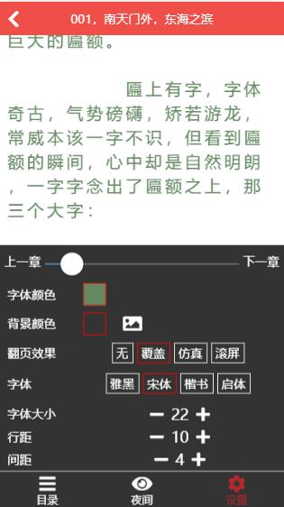

# vue-reader

服务端：[PHP-ZoDream](https://github.com/zx648383079/PHP-ZoDream/tree/master/Module/Book) 未上线

使用 typescript + vue 重构此项目

## DEMO

[live](https://zodream.cn/demo/reader)

## 页面

[√] 书架页

[√] 分类页

[√] 分类榜单页

[√] 搜索页

[√] 书籍页

[√] 书籍目录页

[√] 章节阅读页

[√] 个人中心页

[√] 登录页


## 功能

[√] 书架

[√] 滑动翻页效果

[√] 整屏滑动阅读效果

[√] 无动画翻页效果

[-] 仿真翻页效果（缺陷动画效果暂不能平滑切换角度，翻页背面未实现）

[√] 阅读设置

[√] 左侧目录

[√] 搜索

[√] 分类榜单

[√] 阅读一章进度保存与显示

[√]  可选字体颜色

[√]  可选背景颜色

[√]  可选图片背景

[√]  翻页效果选择

[√]  支持夜间模式

## 预览图





## Build Setup

``` bash
# install dependencies
npm install

# serve with hot reload at localhost:8080
npm run serve

# build for production with minification
npm run build

# build for production with the bundle analyzer report
npm run build -- --report

# run unit tests
npm run test:unit

# run e2e tests
npm run test:e2e

## License

MIT
